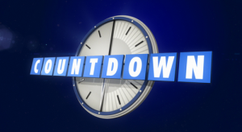
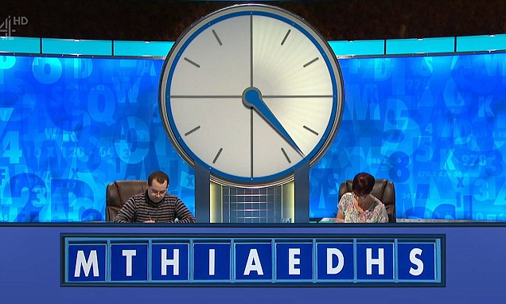

# 🕓Countdown Solver


Find those 8 and 9 letter words to get the highest scores on [Countdown](https://en.wikipedia.org/wiki/Countdown_(game_show)) and win yourself that [teapot](https://en.wikipedia.org/wiki/Countdown_(game_show)#/media/File:Teapot_(levelled).jpg)!
(You'll still need to be good at the maths bit though...)

Built as a fun little Command Line program while watching Countdown, this could easily be adapted for use in a Countdown style game or a puzzle game. It is built using Python and a large JSON document filled with English words. Feed the program 9 letters and it will
check the list of words and return any that are longer than 3 characters. All well within the 30 second Countdown round time limit 😉.

Enjoy! ☕

## Example


```bash
Countdown Letters: FIRJEDIRC
4 - cedi
4 - cire
4 - defi
4 - derf
4 - dice
4 - dier
4 - dire
4 - drie
4 - eric
4 - ferd
4 - ferr
4 - fice
4 - fide
4 - fied
4 - fiji
4 - fire
4 - fred
4 - iced
4 - idic
4 - ired
4 - irid
4 - jiri
4 - recd
4 - refr
4 - reid
4 - reif
4 - rice
4 - ride
4 - rier
4 - rife
4 - rifi
5 - cider
5 - cirri
5 - cried
5 - crier
5 - deric
5 - derri
5 - dicer
5 - dieri
5 - direr
5 - drier
5 - ferri
5 - fieri
5 - fired
5 - firer
5 - freir
5 - fried
5 - frier
5 - icier
5 - irred
5 - jerid
5 - riced
5 - ricer
5 - rider
5 - rifer
6 - deific
6 - dicier
6 - ferric
6 - irride
6 - jerrid
7 - feridji
```
