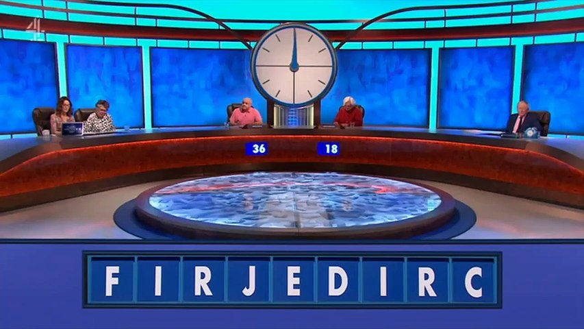

# 🕓Countdown Solver


Countdown Solver is a command-line tool that helps you find the highest-scoring words in the classic UK game show [Countdown](https://en.wikipedia.org/wiki/Countdown_(game_show)).
Give it up to nine random letters, and it will quickly search a large English word list to return every valid word (longer than 3 characters) that can be formed—all within the famous 30-second round time.
Perfect for practicing your skills or adding some word-finding magic to your own puzzle game.

> 💡 You’ll still need to solve the math rounds yourself if you want that coveted [teapot](https://en.wikipedia.org/wiki/Countdown_(game_show)#/media/File:Teapot_(levelled).jpg)!

## ✨ Features

* 🔤 Fast Word Finder – Finds every valid word you can make from 9 letters in seconds.
* 🧩 Flexible Input – Works with anywhere from 3 to 9 letters.
* 🐍 Pure Python – Easy to adapt into other projects or games.

## Example


```bash
Countdown Letters: FIRJEDIRC
4 - cedi
4 - cire
4 - defi
4 - derf
4 - dice
...
6 - ferric
6 - irride
6 - jerrid
7 - feridji
```

## 🛠️ How It Works

* Built in Python.
* Uses a large JSON word list of valid English words.
* Checks all permutations of your letters to find matches longer than 3 characters.

## 🚀 Getting Started

1. Clone this repository:
```bash
git clone https://github.com/Guitaryan93/countdown-solver.git
cd countdown-solver
```

2. Run the solver:
```
python countdown_solver.py
```

3. Enter up to 9 letters when prompted and get your winning words!

## 📄 License

This project is licensed under the [MIT License](LICENSE).

---

Enjoy sharpening your Countdown skills—and maybe winning that teapot! ☕
